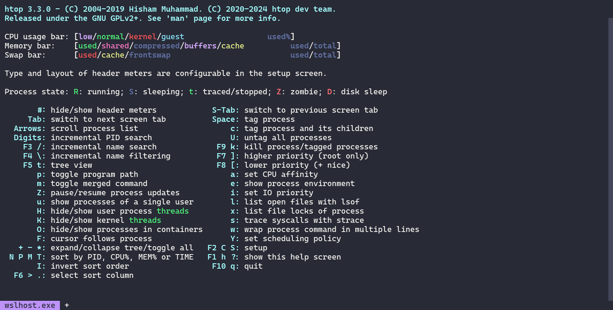
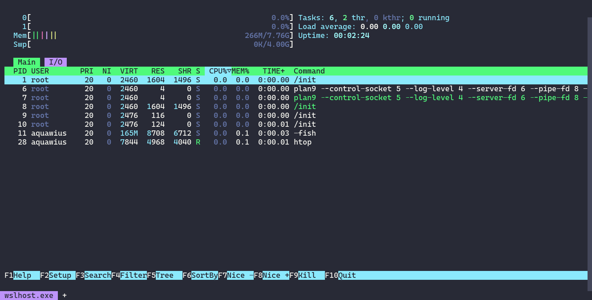
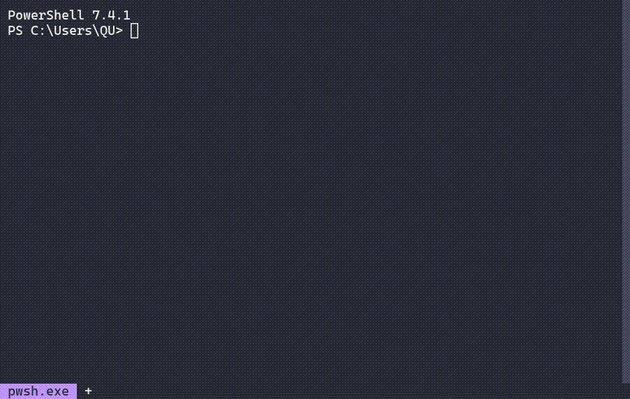
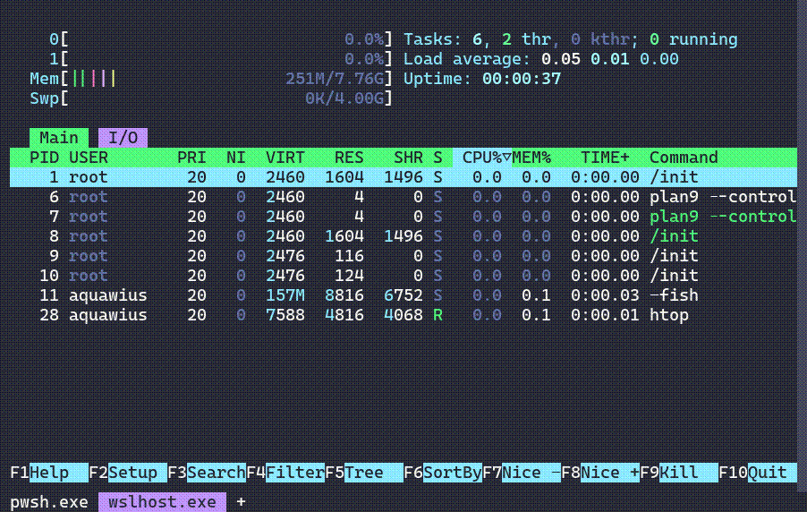

## My own [wezterm](https://wezfurlong.org/wezterm/index.html) configuration file

> Yet another [wezterm](https://wezfurlong.org/wezterm/index.html) configuration file based on [dracula](https://draculatheme.com/) color scheme, adding some useful features.


---

### ✅ Features

- [x]   Dracula color scheme.
- [x]   Nice looking bottom bar.
- [x]   Supports quick startup of various environments. (Need adjust config file)

### :art: Some Screenshot






### 🔨 Get started

1. ##### turn to your `homedir/.config/` folder.

    ```shell
    cd C:/Users/ `username` /.config/
    ```

    > (create '.config' folder if there is no '.config' folder)

2. ##### clone the repository.

  ```shell
  git clone https://github.com/aquawius/wezterm-dracula-theme.git
  ```

3. ##### rename `wezterm-dracula-theme` to `wezterm`.

  ```shell
  C:\USERS
  ├─Public
  ├─QU(Your home directory)
  │  ├─Documents
  │  ├─Downloads
  │  ├─Pictures
  │  ├─.config
  │  │  ├─git
  │  │  └─wezterm	(rename wezterm-dracula-theme to wezterm)
  │  │     └─.git
  │  │     dracula.lua
  │  │     readme.md
  │  │     wezterm.lua
  │  │        ...
  ```

4. ##### Done

Issue and PR is welcomed. :smile:

---

##### :pushpin: ​How to Use

You can find an `+` on the bottom of the terminal.
> Left click `+` to create a default terminal. (pwsh.exe)
>
> Right click `+` to select, you should enter a list of all your terminals
>
> 
>
> Middle click selected tab to close this tab. 
>
> 

---

##### :speech_balloon: The thing you should know

1. The default font of config is [CascadiaCode nerd font](https://www.programmingfonts.org/#cascadia-code), you can download it this link: https://www.nerdfonts.com/font-downloads.

2. The default shell is `powershell7` (pwsh.exe), on Linux is `fish`. If you haven't these shells (or do not use these shells), you can disable them on comment the following lines:

    > Change default shell:
    >
    > ```lua
    > default_prog = {'pwsh'},
    > ```

    > Change shells list:
    >
    > ```lua
    >    table.insert(config.launch_menu, {
    >         label = "Command Prompt",
    >         args = {"cmd.exe"}
    >     })
    >     table.insert(config.launch_menu, {
    >         label = "PowerShell 5",
    >         args = {"powershell.exe", "-NoLogo"}
    >     })
    >     table.insert(config.launch_menu, {
    >         label = "PowerShell 7",
    >         args = {"pwsh.exe", "-NoLogo"}
    >     })
    > 
    >     table.insert(config.launch_menu, {
    >         label = "Anaconda PowerShell Prompt",
    >         args = {"pwsh", "-NoLogo", "-NoExit", "-ExecutionPolicy", "Bypass", "-Command",
    >                 "& 'C:\\ProgramData\\anaconda3\\shell\\condabin\\conda-hook.ps1' ; conda activate 'C:\\ProgramData\\anaconda3' "}
    >     })
    > 
    >     table.insert(config.launch_menu, {
    >         label = "VS Command Prompt 2022 (PowerShell 7)",
    >         args = {"pwsh", "-NoLogo", "-NoExit", "-ExecutionPolicy", "Bypass", "-NoProfile", "-Command",
    >                 " & 'C:\\Program Files\\Microsoft Visual Studio\\2022\\Professional\\Common7\\Tools\\Launch-VsDevShell.ps1'"}
    >     })
    > 
    >     table.insert(config.launch_menu, {
    >         label = "Default WSL Command Prompt",
    >         args = {"wsl"}
    >     })
    > ```

3. For Chinese/English user, if you want to get launch_menu correctly (especially wsl distributions), you should  uncomment the following line:
  ```shell
              -- For English Users, the default line:
              -- local distro = line:gsub(" %(Default%)", "")
              -- For Chinese User,
              local distro = line:gsub(" %(默认%)", "")
  ```

**You can change all the stuff on change configuration.** (If you have time to read [Wezterm document](https://wezfurlong.org/wezterm).)

> There's no License on this repo, do all the stuff you want to do, please show all your imagination to improve it.
